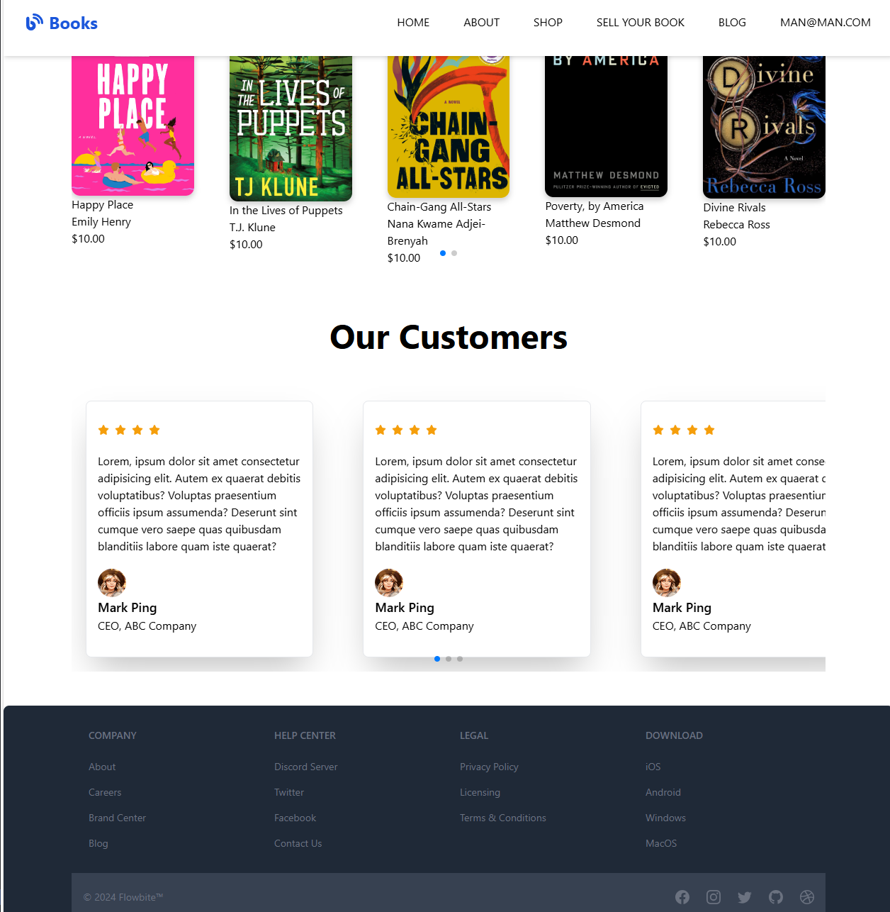

# ActivateWorkBookStore
***Overview***
 Book store  Management System is a MERN  web application designed to manage a collection of books, including adding, viewing, updating, and deleting book entries and more.

 ********************************
 ***Features***
 
User Authentication (Email/Password, Google)
CRUD Operations (Create, Read, Update, Delete) for Books
Responsive UI using Flowbite components

***********
***Technologies Used***

**Frontend**

##React.js:## A JavaScript library for building user interfaces.
##Flowbite:## A component library for building responsive and accessible user interfaces.
##Tailwind CSS:## A utility-first CSS framework for styling.

**Backend**
##Firebase##
##MOngoDb, Mongoose##
##Express##
##NOdeJs##

**Installation**
git clone https://github.com/yourusername/book-management-system.git
cd book-management-system

npm install

set Up firebase

Create a .env file in the root directory and add your Firebase configuration:

REACT_APP_FIREBASE_API_KEY=your-api-key
REACT_APP_FIREBASE_AUTH_DOMAIN=your-auth-domain
REACT_APP_FIREBASE_PROJECT_ID=your-project-id
REACT_APP_FIREBASE_STORAGE_BUCKET=your-storage-bucket
REACT_APP_FIREBASE_MESSAGING_SENDER_ID=your-messaging-sender-id
REACT_APP_FIREBASE_APP_ID=your-app-id

npm start

**here are some screen shots**

